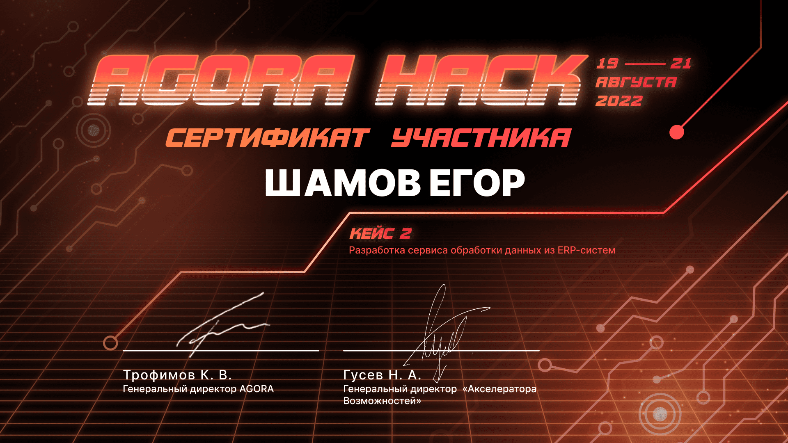

# CV
[View in pdf](https://shameoff.ru/cv.pdf)  
[View on site](https://shameoff.ru/)  
[View on github](https://github.com/shameoff/CV)

## About me

* 2nd year student of the "Higher IT School" at Tomsk State University, majoring in "Software Engineering"
* Based in Tomsk
* Participate in hackathons, sometimes as a curator-organizer
* Love outdoor activities and IT events

## Experience and skills
* I work part-time as a Python teacher at a school of additional education  
(since March 3, 2023)

* Completed in-person professional development courses in Information Security  
April 9, 2023 - April 23, 2023, 144 hours, certificate attached below

* Developing an API for a messenger application using Spring Boot as part of a course project 
[Java Messenger](https://github.com/shameoff/Messenger_SpringLab)

* Some experience in Machine Learning through academic disciplines  
[Toxic Comments Analysis](https://github.com/shameoff/toxic_comments_ML_Lab1)  
[Final project on ML fundamentals](https://github.com/shameoff/ML_lab_cosmos_titanic)

* Familiar with React.js, developed frontend for 2 applications     
[Food Delivery App Frontend](https://github.com/shameoff/Delivery.Kushats)  
[Schedule Management App Frontend](https://gitlab.com/outoftimeinc/frontend/outoftimefrontend)

* Experienced in building REST API applications with Laravel  
[API for "Secret Santa" game](https://github.com/shameoff/YaProfi2023_RestApi_For_Santa)  
[Blog API](https://github.com/shameoff/blogAPI)

* Familiar with the syntax and some features of C++, C# (Unity), Kotlin, Solidity, and Go
[Interpreter for a custom programming language written in Kotlin](https://github.com/shameoff/Interpreter)  
[Approximation and Optimization Algorithms in JS](https://github.com/shameoff/HITs-6-module-Interesting-Algorithms)

* Experience in Linux administration, containerization, virtualization, primarily using Vagrant, Docker, Docker Compose; worked with Python and Node.js stacks; gradually learning network theory and automation tools

* Consider myself a versatile learner, as I enjoy exploring new things and can quickly switch to a new project or technology.

* Proficient in English at B1-B2 level; mentored a group of international freshmen.

## Achievements
* Winner of Samokat.tech Hackathon
* Finalist of Changellenge Cup IT (4th place, "Unconventional Solution" category)
* Finalist of VezdeCode 2022 (21st place)
* Finalist of Rosneft IT Marathon 2022 (16th place)
* Finalist of Skolkovo Hack 2022 (4th place)
* Finalist of Agora Hack 2022 (5th place)
* Graduated from high school with honors

## Contact

## Appendices
All certificates can be downloaded and viewed in their original format here
<!-- An empty line is required here, otherwise the PDF structure will not work correctly -->

