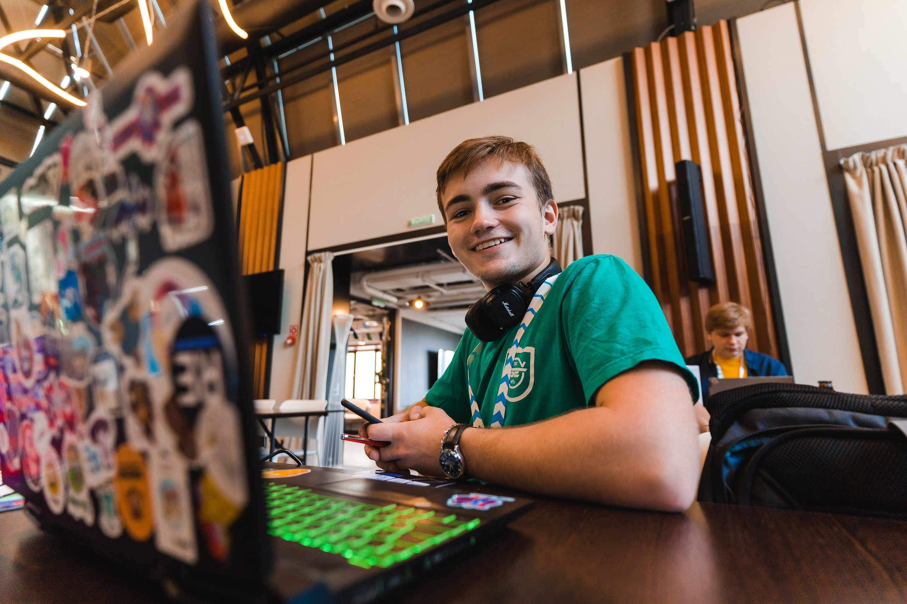
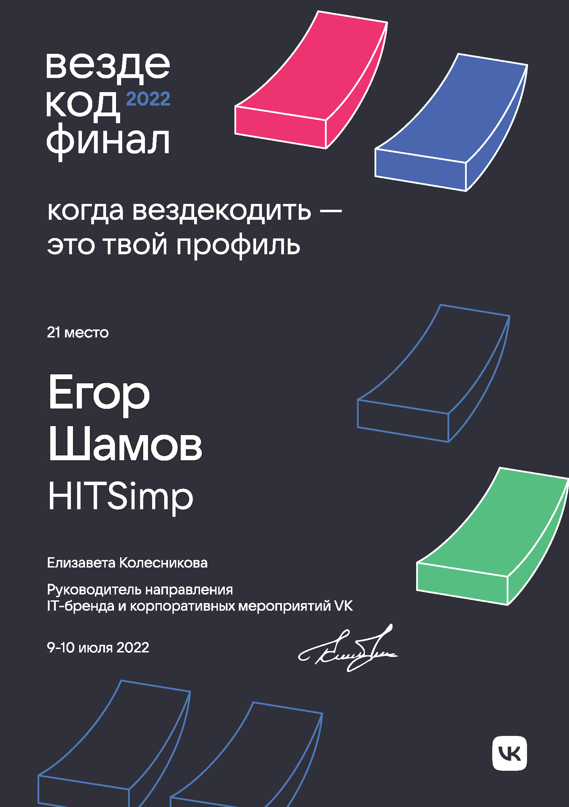
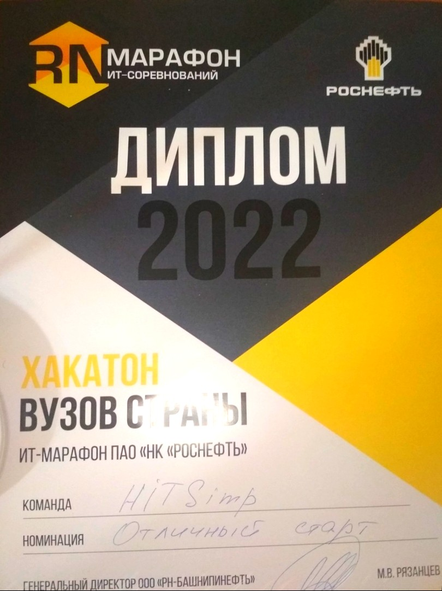
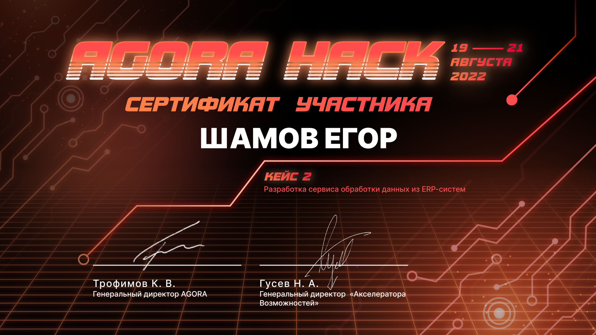

# Резюме
## О себе

* Студент 2 курса "Высшей IT школы" НИ Томского Государственного Университета по направлению "Программная инженерия"
* Живу в Томске
* Участвую в хакатонах, иногда в роли куратора со стороны организаторов
* Люблю активный отдых и IT мероприятия

## Опыт работы и навыки
* Работаю преподавателем Python в школе дополнительного образования на неполной ставке
 (с 03 марта 2023 по текущее время)

* Прошел очные курсы дополнительного профессионального образования по информационной безопасности  
09.04.2023 - 23.04.2023, 144 часа, сертификат в приложении ниже 

* В рамках учебного курса пишу API для мессенджера на Spring Boot  
[Java Messenger](https://github.com/shameoff/Messenger_SpringLab)

* Есть небольшой опыт в ML в рамках учебных дисциплин  
[Анализ токсичных комментариев(в процессе выполнения)](https://github.com/shameoff/toxic_comments_ML_Lab1)  
[Заключительная работа по основам ML](https://github.com/shameoff/ML_lab_cosmos_titanic)

* Знаком с React.js, писал фронтенд для 2 приложений     
[Фронтенд приложения для доставки еды](https://github.com/shameoff/Delivery.Kushats)  
[Фронтенд приложения для управления расписанием](https://gitlab.com/outoftimeinc/frontend/outoftimefrontend)

* Знаком с REST api приложениями на Laravel  
[API для игры "Тайный санта"](https://github.com/shameoff/YaProfi2023_RestApi_For_Santa)  
[API для блога](https://github.com/shameoff/blogAPI)    

* Знаком с синтаксисом и некоторыми особенностями C++, C#(Unity), Kotlin, Solidity и Go  
[Интерпретатор для самописного языка программирования на Kotlin](https://github.com/shameoff/Interpreter)  
[Алгоритмы приближения и оптимизации на JS](https://github.com/shameoff/HITs-6-module-Interesting-Algorithms)

* Есть опыт администрирования Linux, контейнеризации, виртуализации, преимущественно vagrant, docker, docker-compose, неплохо владею Python и node.js стэком, понемногу изучаю теорию сетей и инструменты автоматизации 

* Считаю себя универсальным солдатом, потому что люблю изучать что-то новое и готов моментально переключиться на новый проект или технологию.

* Владею английским на уровне B1-B2, курировал группу иностранцев-первокурсников

## Достижения
* Финалист Changellenge Cup IT (4 место, номинация "Нестандартное решение")
* Финалист Вездекода 2022 (21 место)
* Финалист Rosneft IT марафона 2022 (16 место)
* Финалист Skolkovo Hack 2022 (4 место)
* Финалист Agora Hack 2022 (5 место)
* Окончил школу с медалью  

Все сертификаты находятся в приложении ниже 

## Контакты

## Приложение

