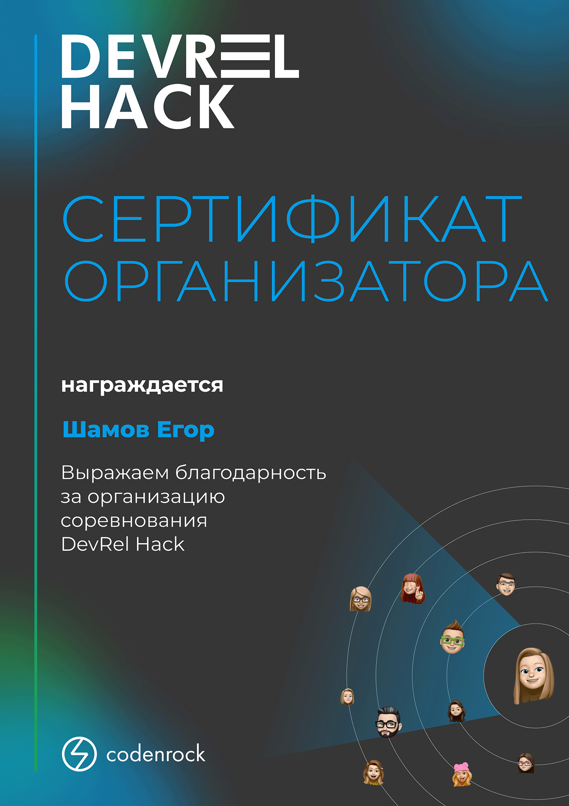

# Резюме
[Смотреть pdf](https://shameoff.ru/cv.pdf)  
[Смотреть на сайте](https://shameoff.ru/)  
[Смотреть на github](https://github.com/shameoff/CV)

## О себе

* Студент 3 курса "Высшей IT школы" НИ Томского Государственного Университета по направлению "Программная инженерия"
* Живу в Томске
* Участвую в хакатонах, иногда со стороны организаторов
* Люблю активный отдых и IT мероприятия

## Опыт работы
* ООО «Тинькофф Центр Разработки»  
**Стажер-разработчик в команде разработки SOC (Python)**  
*(с 10.07.2023 по настоящее время)*

* «Инжинириум МГТУ им. Н.Э. Баумана»  
**преподаватель Python**  
*(03.03.2023 - 31.05.2023)*

### Курсы и дополнительное образование
* **«Актуальные задачи информационной безопасности в компаниях»**  
курсы дополнительного профессионального образования по информационной безопасности  
*09.04.2023 - 23.04.2023*, 144 часа, сертификат в приложении ниже

### Навыки и технологии
* Умею в unit и интеграционное тестирование на pytest + плагины.  
Работал с Allure TestOps, умею генерировать отчеты и селективный запуск тестов из GUI   

* Есть опыт работы с k8s, умею разворачивать микросервисы
* Есть опыт работы с gitlab-ci и Github Actions, умею использовать темплейты

* Пробовал Django ([тык](https://github.com/shameoff/CommunicationsAPI))

* Работал с микросервисами на Spring Boot
([Java Messenger](https://github.com/shameoff/Messenger_SpringLab))

* Писал пару SPA на React + JS
([delivery-app](https://github.com/shameoff/Delivery.Kushats), [schedule-app](https://gitlab.com/outoftimeinc/frontend/outoftimefrontend))

* Писал на Laravel
([blog](https://github.com/shameoff/blogAPI))

* Немножко знаю алгоритмы
([интепретатор на Kotlin](https://github.com/shameoff/Interpreter), 
[визуальные алгоритмы на JS](https://github.com/shameoff/HITs-6-module-Interesting-Algorithms))

* Немного знаком с C++, Go, Kotlin 

* Владею английским на уровне B1-B2, курировал группу иностранцев-первокурсников

## Достижения
* Победитель Samokat.tech Hackathon 2023
* Финалист Changellenge Cup IT 2023 (4 место, номинация "Нестандартное решение")
* Финалист Вездекода 2022 (21 место)
* Финалист Rosneft IT марафона 2022 (16 место)
* Финалист Skolkovo Hack 2022 (4 место)
* Финалист Agora Hack 2022 (5 место)
* Окончил школу с медалью (ну это вообще киллер-фича, я обязан был об этом сказать)  

## Контакты

## Приложение
Все сертификаты можно скачать и посмотреть в исходном формате можно [здесь](https://github.com/shameoff/CV/tree/main/img/certificates) 
<!-- Тут обязательно нужна пустая строка, иначе структура PDF будет работать неправильно -->

